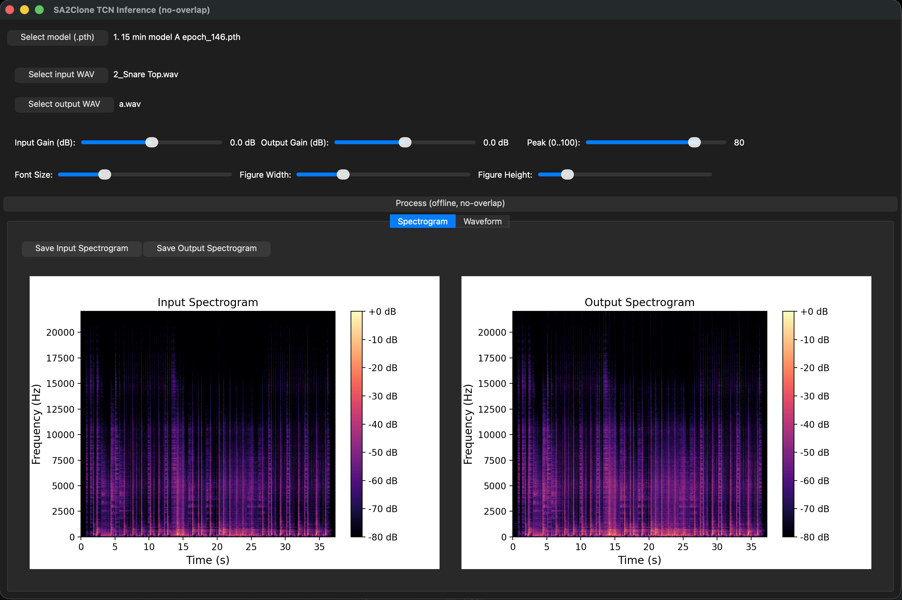
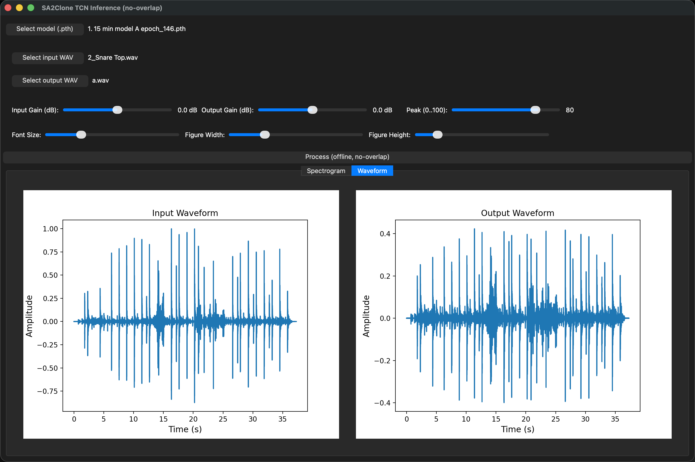

# SA2A GUI TCN Inference Tool

This repository contains an offline inference and visualization tool for the SA-2A-style TCN model used in the associated study.

It is **not** the dataset recording application and **not** the real-time plugin.  
Instead, it is a PyQt5-based desktop application for loading a trained PyTorch model, rendering audio offline, and inspecting the input and output signals with waveform and spectrogram views.

This tool was created for the paper’s offline evaluation workflow, including model inspection, rendering, and visualization.

## Main Features

- Load a trained PyTorch checkpoint (`.pth` or `.pt`)
- Perform offline, non-overlapping inference using a TCN model
- Apply Peak Reduction as a conditioning input
- Adjust input gain and output gain in dB
- Resample input audio to the training sample rate when needed
- Save the processed output as a WAV file
- Visualize input and output as waveform and spectrogram
- Customize plot font size and figure size
- Save the displayed plots as PNG files
- Run on Apple Silicon using MPS when available, otherwise CPU

## What This Tool Does

The script loads a trained TCN-based compressor model and applies it to an input audio file in a frame-wise manner.

The processing path is intentionally simple and matches the inference strategy used in the study.

1. Load an input WAV file.
2. Optionally resample it to 44.1 kHz.
3. Apply input gain.
4. Split the signal into fixed-length, non-overlapping frames of 512 samples.
5. Pass each frame through the TCN model together with the Peak Reduction value.
6. Stitch the processed frames back together without overlap-add.
7. Apply output gain.
8. Save the result as a 32-bit floating-point WAV file.

The GUI also displays the input and output signals so that the user can inspect both time-domain and frequency-domain behavior.

## Repository Purpose

This code was written specifically for the associated research workflow and was used for offline inference and analysis in the paper.

When the paper becomes available, please cite the publication together with this repository.

## Dependencies

Required:

- Python 3
- PyTorch
- NumPy
- librosa
- soundfile
- PyQt5
- matplotlib

Optional:

- torchaudio

## Model Architecture Recreated in the Script

The script recreates the training-time model classes directly in Python:

- `PeakCond`
- `DilatedBlock`
- `TCNModel`

The model structure is:

- input projection layer
- Peak Reduction conditioning branch
- 16 dilated convolution blocks
- skip aggregation
- output projection layers

The conditioning signal is built from the Peak Reduction value and broadcast across the full frame length.

## Checkpoint Loading

The script includes a robust checkpoint loader that can handle common PyTorch save formats, including:

- raw `state_dict`
- `model_state`
- `model_state_dict`
- `state_dict`
- `model`
- full `nn.Module` objects in some cases

This makes it easier to use checkpoints saved with slightly different training scripts.

## Inference Behavior

The offline inference pipeline is intentionally conservative:

- no overlap-add reconstruction
- frame-wise processing only
- same input/output frame length
- fixed 512-sample processing window
- symmetric zero-padding at the signal edges

This design matches the way the model was trained and avoids hidden interpolation or host-side time warping.

## GUI Overview

The application window contains the following sections:

### Model Selection
- Load a model checkpoint file
- Display the selected model name
- Clear the currently loaded model

### File Selection
- Select input audio file
- Select output WAV file

### Audio Controls
- Input Gain in dB
- Output Gain in dB
- Peak Reduction from 0 to 100

### Visualization Controls
- Font size for plots
- Figure width
- Figure height

### Processing Button
- Run offline inference and save the output WAV

### Plot Tabs
- Spectrogram tab
- Waveform tab

Each tab shows both the input and the processed output.

## Screenshots

### Spectrogram View

  

This screenshot shows the GUI together with the spectrogram view.

### Waveform View

  

This screenshot shows the GUI together with the waveform view.

## GUI Controls

| Control | Description |
|---|---|
| Select model (.pth) | Loads a trained checkpoint file |
| Select input WAV | Chooses the source audio file |
| Select output WAV | Chooses where the processed file will be saved |
| Input Gain (dB) | Applies pre-model gain scaling |
| Output Gain (dB) | Applies post-model gain scaling |
| Peak (0..100) | Conditioning value passed to the TCN |
| Font Size | Adjusts plot text size |
| Figure Width | Adjusts plot width |
| Figure Height | Adjusts plot height |
| Save Input Spectrogram | Saves the displayed input spectrogram as PNG |
| Save Output Spectrogram | Saves the displayed output spectrogram as PNG |
| Process | Runs offline inference |

## Visualization Tools

The built-in plots are intended for quick inspection of model behavior.

### Spectrogram View
The spectrogram view shows the time-frequency distribution of the input and output signals.

### Waveform View
The waveform view shows the amplitude envelope and time-domain shape of the audio.

### Plot Customization
You can adjust:

- font size
- figure width
- figure height

These changes affect both readability and export quality.

### Saving Figures
The displayed plots can be saved as PNG files directly from the GUI.

## Audio Processing Details

### Input Gain
The input gain slider is shown in dB and converted internally to linear gain before inference.

### Output Gain
The output gain slider is also shown in dB and converted internally to linear gain after inference.

### Peak Reduction
Peak Reduction is passed into the model as a conditioning parameter.

The value is normalized to the 0–100 range used during training.

### Resampling
If the input file is not already at 44.1 kHz, the script resamples it to the training sample rate before inference.

### Output Format
The processed audio is written as a 32-bit floating-point WAV file using `soundfile`.

## Device Selection

The script automatically uses:

- Apple MPS if available
- otherwise CPU

This makes it suitable for Apple Silicon systems while still remaining usable on standard CPU-only machines.

## How to Use

1. Install the required Python packages.
2. Run the script.
3. Click **Select model (.pth)** and choose a trained checkpoint.
4. Click **Select input WAV** and choose an audio file.
5. Click **Select output WAV** and choose the destination file.
6. Adjust:
   - Input Gain
   - Output Gain
   - Peak Reduction
7. Click **Process**.
8. Review the waveform and spectrogram tabs.
9. Save the plots if needed.

## File Format Expectations

The input file can be a WAV file or another audio format supported by `librosa`, but WAV is recommended for reproducibility.

The model checkpoint should match the exact architecture defined in this script.

## Limitations

- Offline inference only
- No real-time streaming
- Fixed processing window of 512 samples
- No overlap-add reconstruction
- Model architecture must match the recreated classes in the script
- Designed for the paper’s trained TCN checkpoints, not arbitrary compressor models

## Relation to the Research

This script was developed as part of the offline inference workflow for the SA-2A modeling study.

It is intended for model rendering, inspection, and visualization of the trained TCN compressor, rather than for recording or real-time plugin deployment.
